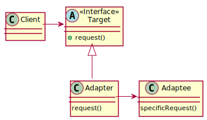
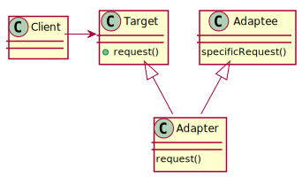
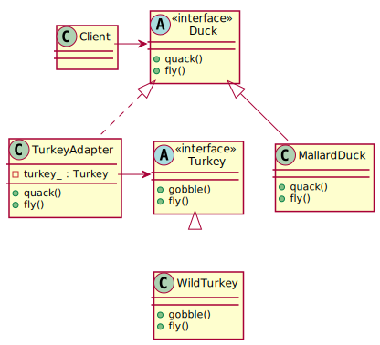

# Adapter Pattern

## Definition

**The Adapter Pattern** converts the interface of a class into another interface the clients expect. Adapter lets classes work together that couldn't otherwise because of incompatible interfaces.

## Class diagram schema for Object Adapter pattern

## Class diagram schema for Class Adapter pattern

## Class diagram of Adapter Pattern example

