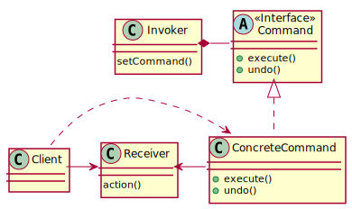
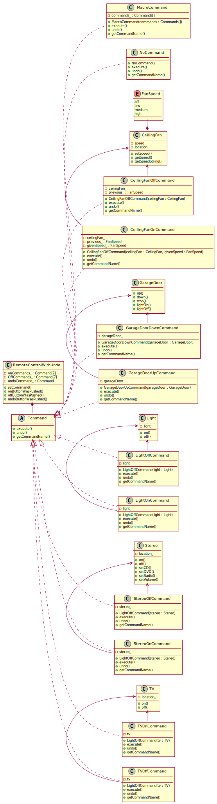

# Command Pattern

## Definition

**Command pattern** - encapsulates a request as an object, therby letting you parametrize clients with different requests, queue or log requests, and support undoable operations.

## Class diagram schema for Command pattern

## Class diagram for SimpleRemoteControlWithUndo example
Client(main.cpp) from diagram was removed to make diagram more clear.

