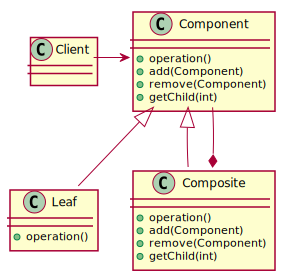
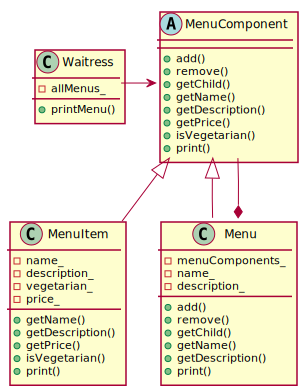

# Composite Pattern

## Definition

**The Composite Pattern** - allows you to compose objects into tree structures to represent part-whole hierarchies. Composite lets clients treat individual objects and compostions of object uniformly.

## Design principle

A class should have only one reason to change

## Class diagram schema for Composite pattern

## Class diagram of Composite Pattern example

