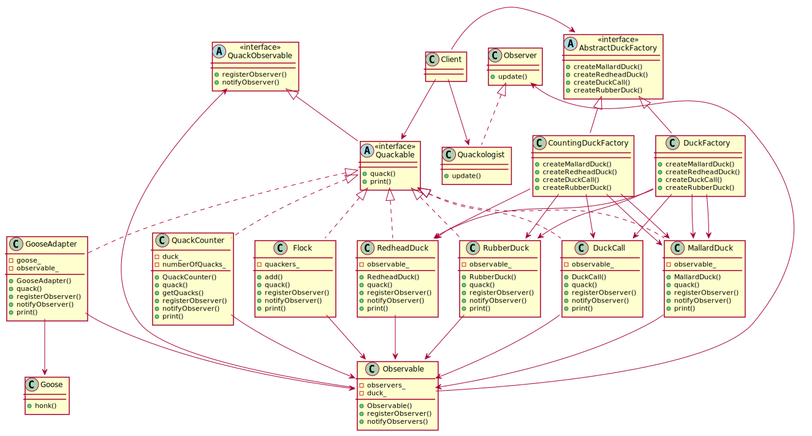

# Compound patterns

## Definition

**The Compound Pattern** - combines two or more patterns into a solution that solves a recurring or general problem.

## Example of compounds patterns

This example uses patterns mentioned below:

* **Adapter** (as GooseAdapter)
* **Decorator** (as QuackCounter)
* **Abstract** Factory (as CountingDuckFactory)
* **Composite** (as Flock)
* **Iterator** (iterating over Flock)
* **Observer** (as Quackologist)

## Class diagram of example

