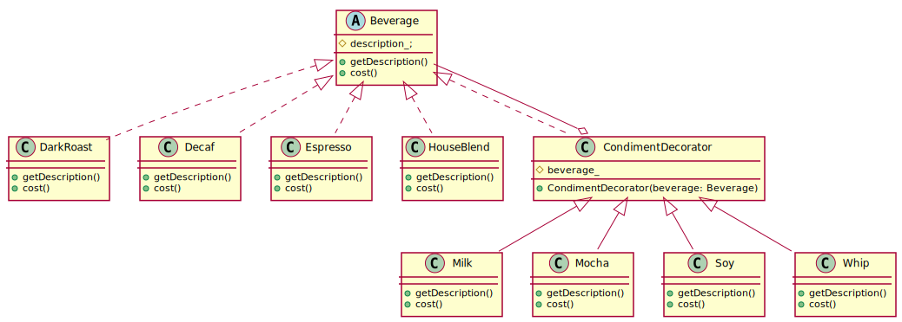

# Decorator Pattern

## Definition

The Decorator Pattern attaches additional responsibilites to an object dynamically. Decorators provide a flexible alternative to subclassing for extending functionality.

## Design principle

1. Identify the aspects of your application that vary and separate them from what stays the same

2. Program to an interface, not an implementation.

3. Favor composition over inheritance.

4. Strive for loosely coupled designs between objects that interact.

5. **Classes should be open for extension, but closed for modification.**

## Class diagram for this pattern

