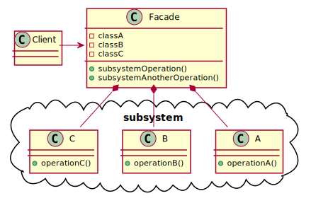
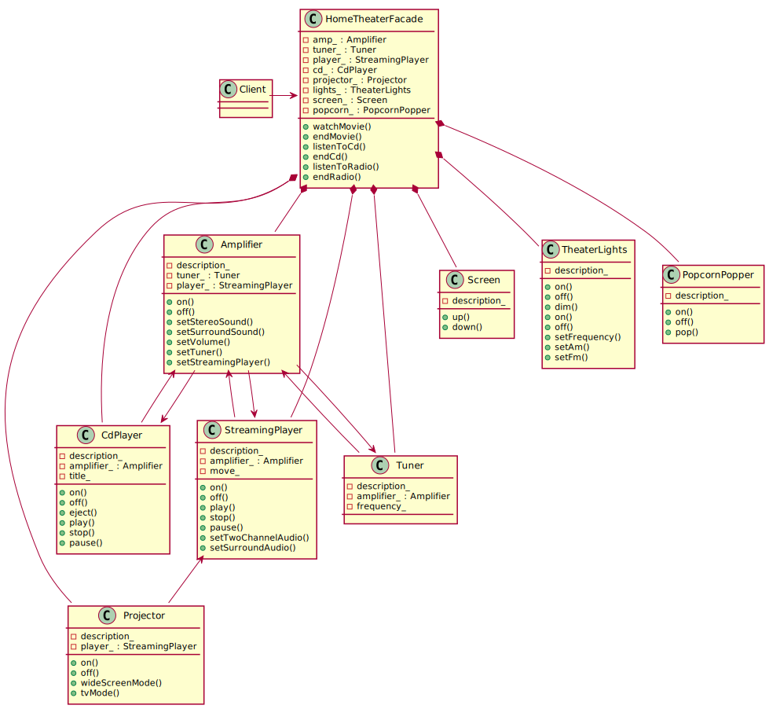

# Facade Pattern

## Definition

**The Facade Pattern** provides a unified interface to a set of interfaces in a subsystem. Facade defines a higher-level interface that makes the subsystem easier to use.

## Design principle

*Principle of the Least Knowledge (Law of Demeter)* - talk only to your immediate friends.

## Class diagram schema for Command pattern

## Class diagram of facade example

