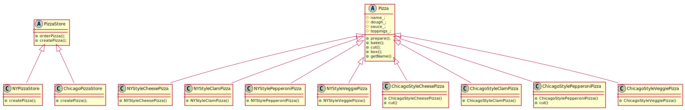

# Factory Method Pattern

## Definition

The Factory Method Pattern defines an interface for creating an object, but lets subclasses decide which class to initiate. Factory Method lets a class defer instantiation to subclasses.

## Design principle

**Depend upon abstractions. Do not depend upon concrete classes**

## Class diagram for this pattern

