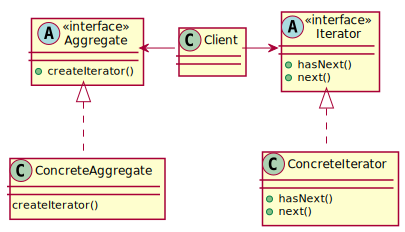
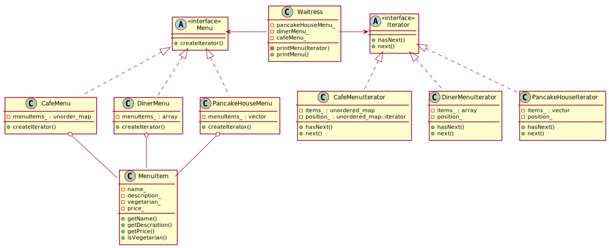

# Iterator Pattern

## Definition

**The Iterator Pattern** provides a way to access the elements of an aggregate object sequentially without exposing its underlying representation.

## Design principle

A class should have only one reason to change

## Class diagram schema for Iterator pattern

## Class diagram of Iterator Pattern example

