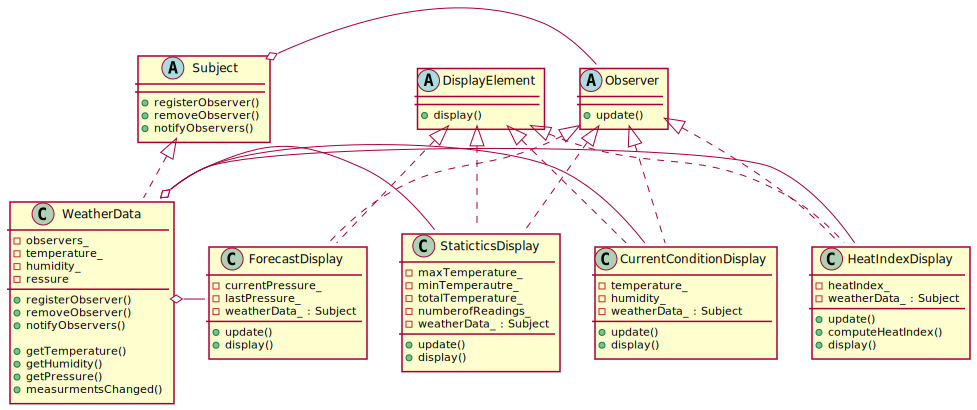

# Observer Pattern

## Definition

Observer Pattern defines a one-to-many dependency between objects so that when one object changes state, all its dependencies are notified and updated automatically.

## Design principle

1. Identify the aspects of your application that vary and separate them from what stays the same

2. Program to an interface, not an implementation.

3. Favor composition over inheritance.

4. Strive for loosely coupled designs between objects that interact.

## Class diagram for pattern

