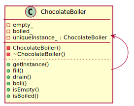

# Singleton Pattern Pattern

## Definition

The Singleton Pattern ensure a class only has one instance and provide a global point of access to it.

## Compile

To compile use command: **g++ -std=c++17 main.cpp -o main**

## Class diagram for this pattern

