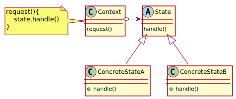
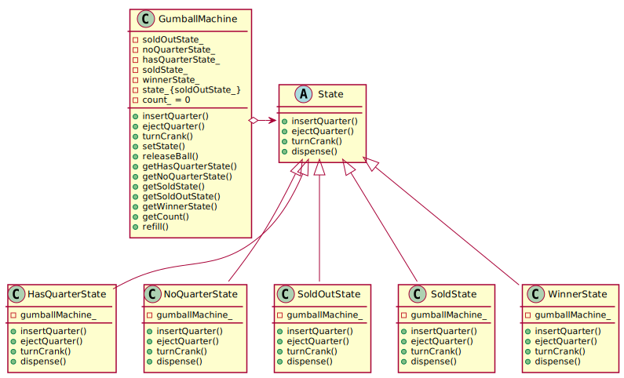

# State Pattern

## Definition

**The State Pattern** - allows an object to alter its behavior when its internal state changes. The object will appear to change its class.

## Similarity with Strategy Pattern

The State and Strategy Patterns have the same class diagrams, but they differ in intent.

* Strategy Pattern typically configures Context classes with a behaviour or algorithm
* State Pattern allows a Context to change its behaviour as the state of the Context changes.

## Class diagram schema for State pattern

## Class diagram of State Pattern example

