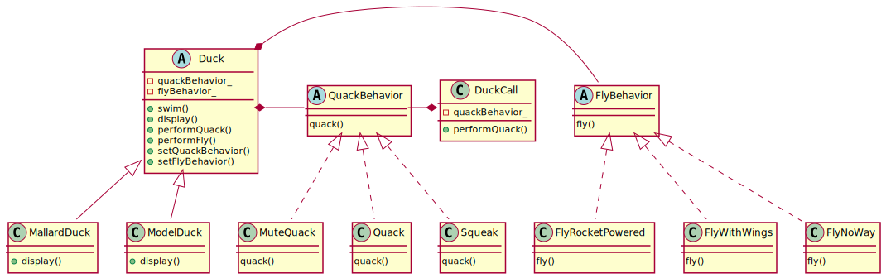

# Startegy Pattern

## Definition

Strategy Pattern defines a family of algorithms, encapsulates each one, and make them interchangeable. Strategy lets the algorithm vary independently from clients that use it.

## Design principle

1. Identify the aspects of your application that vary and separate them from what stays the same

2. Program to an interface, not an implementation.

3. Favor composition over inheritance.

## Class diagram for pattern

