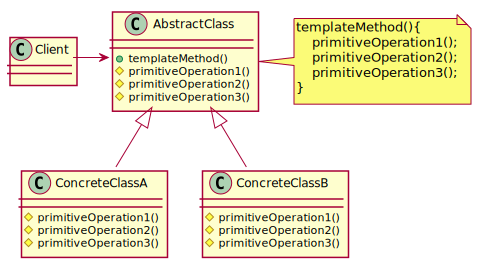
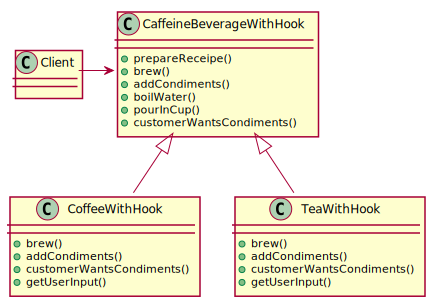

# Template Method Pattern

## Definition

**The Template Method Pattern** defines the skeleton of an algorithm in a method, deferring some steps to subclasses. Template Method lets subclasses redefine certain steps of an algorithm without changing the algorithm's structure.

## Design principle

*The Hollywood Principle* - Don't call us, we'll call you.

## Connection beetween Template Method and Factory Method pattern.

The Factory Method is a specialization of Template Method

## Class diagram schema for Template Method pattern

## Class diagram of Template Method example

